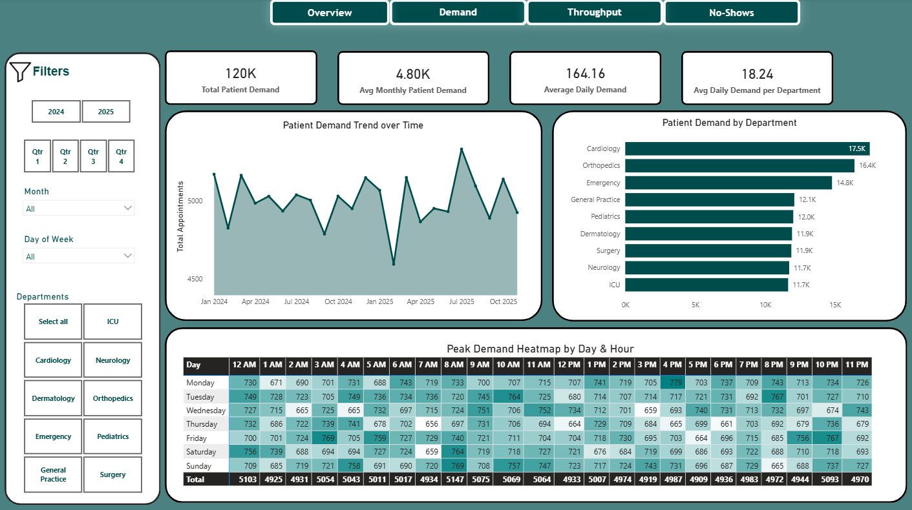
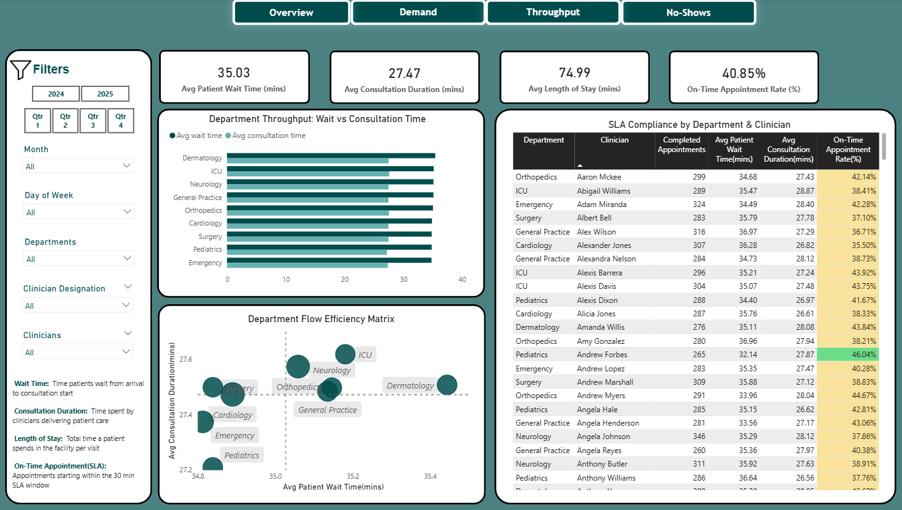
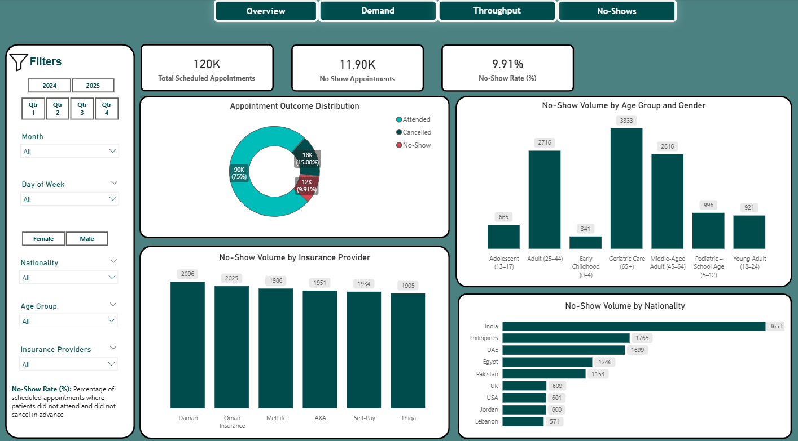

# Healthcare Operations Intelligence — ApexCare Medical Center

## Executive Summary

This project studies hospital data from **ApexCare Medical Center** to understand what patients experience during a typical visit.

Every day, patients arrive expecting timely care, but some departments get crowded, some hours feel rushed, and many patients wait longer than they should. This project tells the story behind that experience by following how patients move through the hospital—from booking an appointment to seeing a doctor—and showing where things slow down.

It answers three simple but important questions:
- **Where and when patient demand is highest**
- **Why patients spend so much time waiting before care begins**
- **How missed appointments quietly waste hospital capacity**

By turning daily hospital activity into clear patterns across departments, time, and patient groups, this project helps hospital leaders see what is really happening on the ground and make smarter decisions to improve flow, reduce delays, and use existing resources more effectively.

---

## Executive Questions Addressed

### 1. Patient Demand & Bottlenecks
Which departments are the busiest, **when patients come in (day, hour, month)**, and **where crowding or slowdowns happen** that may need more staff or better planning?

### 2. Clinical Throughput & Appointment Timeliness
How smoothly patients move through a hospital visit, **where waiting time builds up**, and which departments or schedules struggle to start appointments on time?

### 3. No-Show Impact
Which patient groups miss appointments the most, and **how missed visits reduce hospital capacity** that could have been used for other patients?

---

## Decisions This Enables
- Where to **add or shift capacity** (by department, day, hour, or season)
- How to **improve front-end workflows** like check-in and triage to reduce waiting
- How to **measure clinician performance fairly** using SLA benchmarks
- How to **reduce the impact of no-shows** using smarter scheduling instead of blind overbooking

---

## Tools Used
**SQL** | **Python** | **Power BI**

---

## Project Architecture (High Level)
**Problem Framing** → **Data Foundation** → **Analytical Engineering** → **Executive Outputs**

- **Problem Framing:** Start with clear executive questions about demand, delays, and missed appointments  
- **Data Foundation:** Clean, structured hospital data built into reliable tables for analysis  
- **Analytical Engineering:** Metrics designed so departments and time periods can be compared fairly  
- **Executive Outputs:** Power BI dashboards that turn numbers into decisions, insights, and recommendations  

---

## Power BI Dashboard Overview
*(Page 1 — Patient Demand & Bottlenecks)*  

*(Page 2 — Clinical Throughput & Appointment Timeliness)* 

*(Page 3 — No-Show Impact)* 

